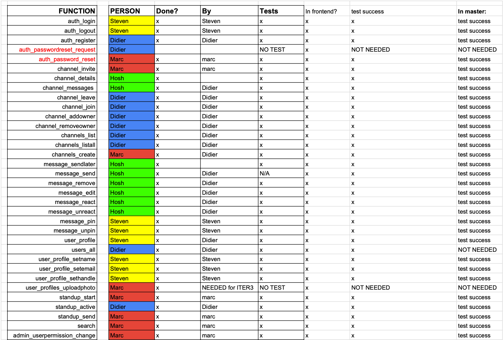

# The Development Stage Plan

For our upcoming development stage, our team dishDANG decided to focus specifically, on a user driven experience that can help act as the bone structure for the front-end developers, BananaPie. By knowing what functions are required to be finished in order to run the python server correctly, we would have to plan our development stage efficiently and accurately in order to anticipate the stage ahead. By analysing the requirements given to the back-end team, we brainstormed our thoughts into what functions should be implemented first and listed all 32 functions by priority. We started off with the main authentication functions with the abbreviation auth, which we coined as our first stage. We decided to split the 32 tests amongst ourselves to give each person eight functions to complete by the end of this stage. We specifically did it in this way as each of us had written specific tests for eight separate functions. A picture of our allocations is listed below (Fig. 1). After the authentication functions finished, we would then have the base for the creation of our other functions, as many of these require the use of the auth functions (e.g. channel_addowner). The next stage would be to finish admin and user functions, as this would provide the basic functionality of the user and contains some of the most important functions in the development. After this, dishDANG will finish the search, stand-up and channel functions to finish the main skeleton of the primary functions. Finally, we will complete the message functions and vigorously test the program to ensure the development stage has been completed with precision and timeliness. In order to keep track of our progress in the development stage, a Gantt Chart can be seen below (Fig. 2), outlining our plan to the following stage.

**Fig 1:** Spreadsheet indicating our function allocations

**Fig 2** : Gantt Chart

 
